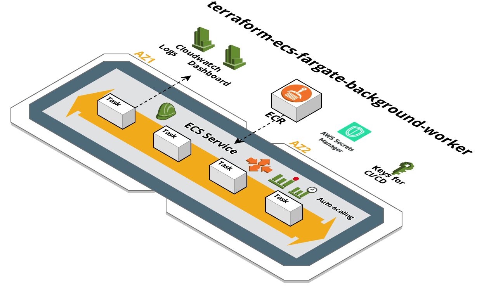

# Terraform ECS Fargate Background Worker

A set of Terraform templates used for provisioning a background worker stack on [AWS ECS Fargate][fargate].  This template is similar to the [web app template](https://github.com/turnerlabs/terraform-ecs-fargate) but without the ALB.  This means that you get an ECS service without ingress.



The templates are designed to be customized.  The optional components can be removed by simply deleting the `.tf` file.

The templates are used for managing infrastructure concerns and, as such, the templates deploy a [default backend docker image](env/dev/ecs.tf#L26).  We recommend using the [fargate CLI](https://github.com/turnerlabs/fargate) for managing application concerns like deploying your actual application images and environment variables on top of this infrastructure.  The fargate CLI can be used to deploy applications from your laptop or in CI/CD pipelines.

## Components

### base

These components are shared by all environments.

| Name | Description | Optional |
|------|-------------|:---:|
| [main.tf][bm] | AWS provider, output |  |
| [state.tf][bs] | S3 bucket backend for storing Terraform remote state  |  |
| [ecr.tf][be] | ECR repository for application (all environments share)  |  ||


### env/dev

These components are for a specific environment. There should be a corresponding directory for each environment
that is needed.

| Name | Description | Optional |
|------|-------------|:----:|
| [main.tf][edm] | Terrform remote state, AWS provider, output |  |
| [ecs.tf][ede] | ECS Cluster, Service, Task Definition, ecsTaskExecutionRole, CloudWatch Log Group |  |
| [nsg.tf][edn] | NSG for ALB and Task |  |
| [dashboard.tf][edd] | CloudWatch dashboard: CPU, memory, and HTTP-related metrics | Yes |
| [role.tf][edr] | Application Role for container | Yes |
| [cicd.tf][edc] | IAM user that can be used by CI/CD systems | Yes |
| [autoscale-perf.tf][edap] | Performance-based auto scaling | Yes |
| [autoscale-time.tf][edat] | Time-based auto scaling | Yes |
| [logs-logzio.tf][edll] | Ship container logs to logz.io | Yes |
| [secretsmanager.tf][sm] | Provision a Secrets Manager secret for your app | Yes |


## Usage

Typically, the base Terraform will only need to be run once, and then should only
need changes very infrequently. After the base is built, each environment can be built.

```
# Move into the base directory
$ cd base

# Sets up Terraform to run
$ terraform init

# Executes the Terraform run
$ terraform apply

# Now, move into the dev environment
$ cd ../env/dev

# Sets up Terraform to run
$ terraform init

# Executes the Terraform run
$ terraform apply
```


## Additional Information

+ [Base README][base]

+ [Environment `dev` README][env-dev]


[fargate]: https://aws.amazon.com/fargate/
[bm]: ./base/main.tf
[bs]: ./base/state.tf
[be]: ./base/ecr.tf
[edm]: ./env/dev/main.tf
[ede]: ./env/dev/ecs.tf
[edn]: ./env/dev/nsg.tf
[edd]: ./env/dev/dashboard.tf
[edr]: ./env/dev/role.tf
[edc]: ./env/dev/cicd.tf
[edap]: ./env/dev/autoscale-perf.tf
[edat]: ./env/dev/autoscale-time.tf
[edll]: ./env/dev/logs-logzio.tf
[sm]: ./env/dev/secretsmanager.tf
[base]: ./base/README.md
[env-dev]: ./env/dev/README.md
